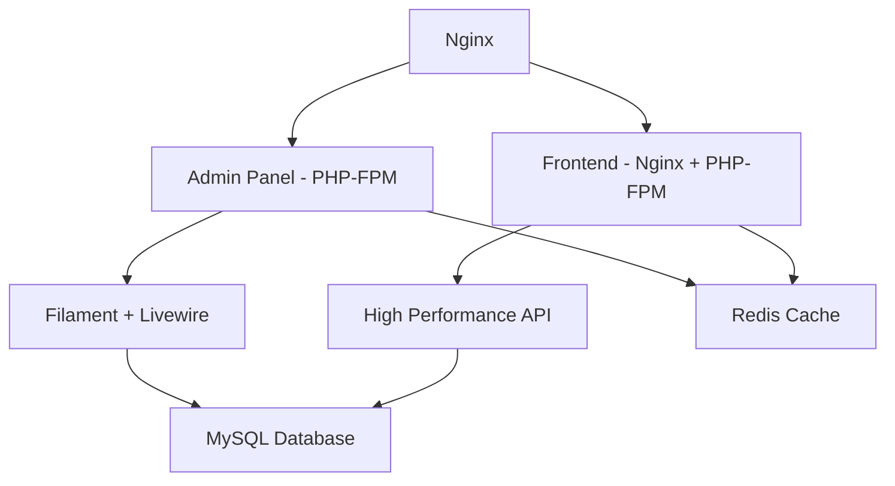

# 📚 KraftDo NFC - Documentación Técnica

Esta carpeta contiene toda la documentación técnica del proyecto KraftDo NFC.

## 📖 **Índice de Documentación**

### 🚀 **Configuración y Setup**
- **[🔧 ENVIRONMENT.md](./ENVIRONMENT.md)** - Guía completa de configuración de entornos (.env files)
- **[🐳 DOCKER.md](./DOCKER.md)** - Configuración y uso de Docker
- **[🚀 DEPLOYMENT_COMMANDS.md](./DEPLOYMENT_COMMANDS.md)** - Comandos para deploy y producción

### ⚡ **Performance y Arquitectura**

### 👨‍💻 **Desarrollo y Funcionalidades**
- **[👨‍💻 FILAMENT_USAGE.md](./FILAMENT_USAGE.md)** - Guía de uso del panel administrativo
- **[🎭 ADDING_NEW_CONTENT_TYPES.md](./ADDING_NEW_CONTENT_TYPES.md)** - Como agregar nuevos tipos de contenido NFC
- **[🔐 TOKEN_PERMISSIONS.md](./TOKEN_PERMISSIONS.md)** - Sistema de permisos y tokens

## 🏗️ **Arquitectura del Sistema**



## 📋 **Quick Reference**

### **URLs de Desarrollo:**
- Admin Panel: `http://localhost:8082/admin`
- Frontend: `http://localhost:8082/`
- Health Check: `http://localhost:8082/health`

### **Comandos Docker:**
```bash
# Levantar servicios
docker compose -f docker-compose.dual.yml up -d

# Ver logs
docker compose -f docker-compose.dual.yml logs -f

# Ejecutar comandos Laravel
docker compose -f docker-compose.dual.yml exec app php artisan [command]

# Acceso a shell
docker compose -f docker-compose.dual.yml exec app sh
```

### **Comandos Laravel Frecuentes:**
```bash
# Limpiar caches
php artisan optimize:clear

# Cachear configuración (producción)
php artisan config:cache
php artisan route:cache
php artisan view:cache

# Migraciones
php artisan migrate
php artisan migrate:fresh --seed

```

## 🔍 **Troubleshooting Rápido**

| Problema | Solución | Documentación |
|----------|----------|---------------|
| Livewire 404 error | `php artisan livewire:publish --assets` | [ENVIRONMENT.md](./ENVIRONMENT.md) |
| DB connection error | Verificar `.env` y MySQL externo | [ENVIRONMENT.md](./ENVIRONMENT.md) |
| Docker build fails | Revisar Dockerfile.dual | [DOCKER.md](./DOCKER.md) |
| Redis connection | Verificar Redis host en `.env` | [REDIS_OCTANE_SETUP.md](./REDIS_OCTANE_SETUP.md) |

## 📝 **Convenciones de Documentación**

- **📝 Formato**: Markdown con emojis para facilitar navegación
- **🔗 Enlaces**: Referencias cruzadas entre documentos
- **💡 Ejemplos**: Código funcional en todos los casos
- **⚠️ Notas**: Advertencias importantes destacadas
- **✅ Checklists**: Pasos verificables

## 🆕 **Actualizaciones**

Este directorio se mantiene actualizado con:
- Nuevas características implementadas
- Cambios en configuración
- Mejoras de rendimiento
- Soluciones a problemas comunes

Para contribuir a la documentación, sigue el formato establecido y incluye ejemplos prácticos.

---

**📚 Documentación mantenida por el equipo KraftDo**